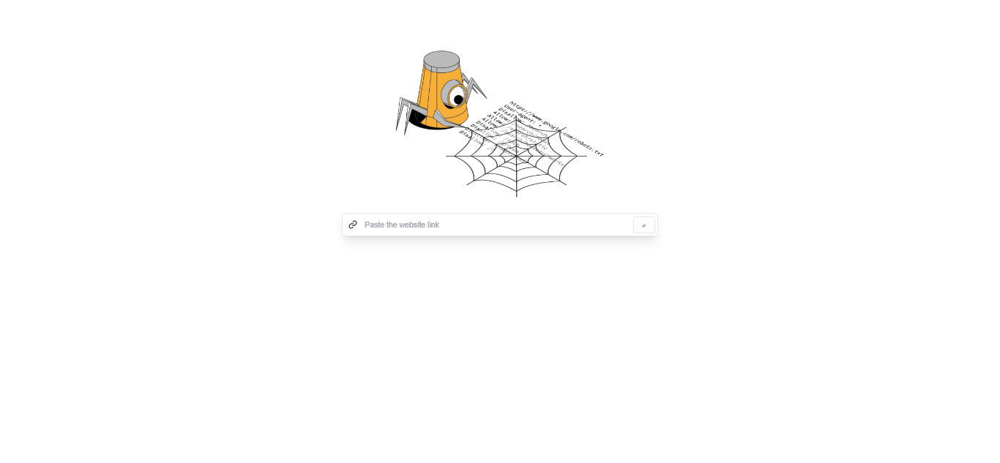
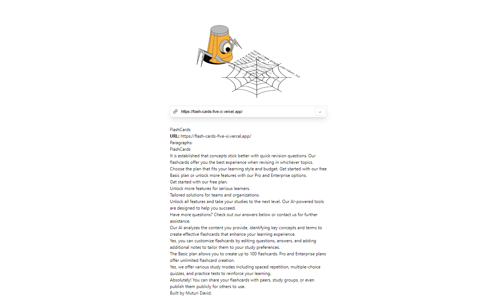
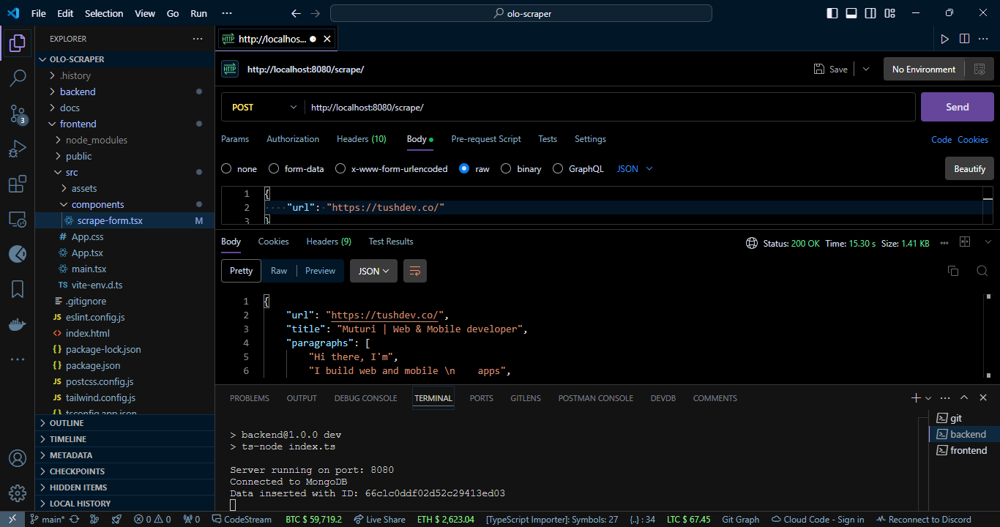

# OloScraper - Web Scraping and Browser Interaction Application

## Project Overview

This is a full-stack web scraping application that simulates browser-like interactions using a headless browser. Users can input a URL, and the application scrapes data and performs specified actions.

## Technologies

* React - Frontend Framework
* Node.js - Backend Runtime
* Express.js - Web Server Framework
* MongoDB - Database
* Puppeteer - Headless Browser for Web Scraping
* TailwindCSS - Styling

## Features

* Web scraping interface
* Simulated browser interactions (click, fill forms, scroll)
* Display scraped data and interaction results
* Store scraping and interaction data in MongoDB
* Basic error handling and logging

## Features to Add

* Chrome DevTools Protocol integration for enhanced browser control
* Multi-action sequence support
* Customizable interaction selectors
* Performance metrics for scraping and interactions
<!-- * Advanced error handling and recovery strategies -->

## Screenshots





## Getting Started

### 1.Clone the repository

    ```bash 
    git clone https://github.com/tushcmd/olo-scraper.git
    ```

### 2.Install dependencies

     ```sh
    cd olo-scraper'
    # then
    cd backend
    npm install
    cd frontend
    npm install
    ```

### 3. Set up environment variables

    Copy the `.env.example` file into a `.env` file, edit it with all the necessary environment variables.

### 4. In separate terminals start the backend server and frontend development server

    ```sh
    npm run dev
    ```

Open <http://localhost:5173> (or the port specified by your React setup) with your browser to see the result.

## Usage

1. Enter a URL in the input field
2. Select desired interactions from the dropdown
3. Click "Scrape and Interact" to start the process
4. View the results displayed on the page
